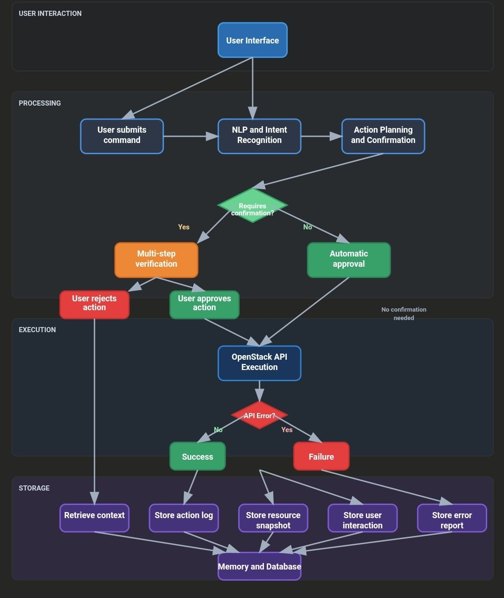

# Agentic AI Cloud Backend

# Architecture diagram



## Project Structure

```
Ai-cloud-agent/
├── Frontend/
├── app/
│   ├── api/
│   │   └── v1/
│   │       ├── nlp_routes.py
│   │       ├── cloud_routes.py
│   │       └── confirm_routes.py
│   ├── core/
│   │   ├── config.py
│   │   └── logger.py
│   ├── services/
│   │   ├── nlp_engine.py
│   │   ├── cloud_executor.py
│   │   └── confirmer.py
│   ├── db/
│   │   ├── models.py
│   │   ├── session.py
│   │   └── crud.py
│   ├── schemas/
│   │   ├── nlp.py
│   │   ├── cloud.py
│   │   └── base.py
│   ├── utils/
│   │   ├── validators.py
│   │   └── openstack_auth.py
│   └── main.py
├── nlp_model/
│   ├── data/
│   ├── domain.yml
│   ├── config.yml
│   └── actions/
│       └── custom_actions.py
├── tests/
│   ├── conftest.py
│   ├── test_nlp.py
│   ├── test_api.py
│   └── test_openstack.py
├── .env
├── requirements.txt
├── Dockerfile
├── docker-compose.yml
└── .github/
    └── workflows/
        └── ci.yml
```
