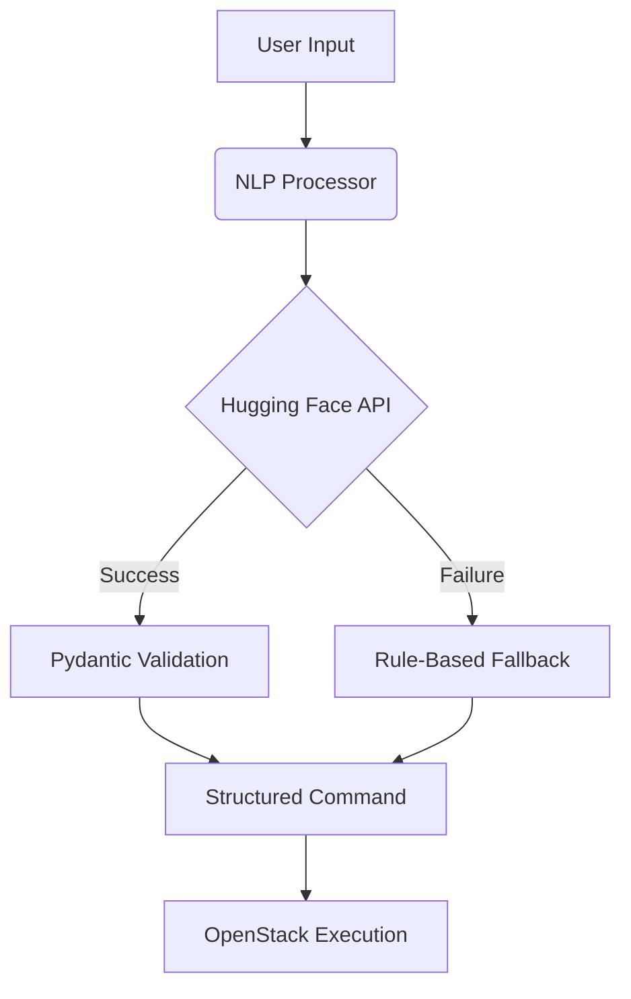

# NLP Command Processor Documentation

## AI Agent Architecture
*Figure 1: NLP Processor in AI Agent Architecture*

## 1. Overview
The NLP Command Processor is the cognitive core of the AI Cloud Agent, responsible for converting natural language commands into structured, executable operations. This component leverages Microsoft's Phi-3-mini language model through Hugging Face's Inference API to interpret user intents and translate them into precise OpenStack operations.

### Key Features
- Natural language to structured JSON translation
- Automatic validation of command parameters
- Rule-based fallback mechanism
- Error handling and recovery
- Test-driven development support

## 2. Architecture



*Figure 2: NLP Processing Workflow*

### Components
- **Hugging Face Interface**: Communicates with Phi-3-mini model
- **Prompt Engineering System**: Creates optimized LLM inputs
- **Validation Layer**: Ensures output compliance with schema
- **Fallback Parser**: Rule-based backup when LLM fails
- **Error Handler**: Manages exceptions and recovery

## 3. Installation

### Prerequisites
- Python 3.10+
- GitHub Student Pack activated Hugging Face account
- OpenStack simulator (DevStack) for testing

```bash
# Clone repository
git clone https://github.com/ALOK-Yeager/Ai_cloud_agent.git
cd Ai_cloud_agent/nlp_processor

# Create virtual environment
python -m venv .venv
source .venv/bin/activate

# Install dependencies
pip install -r requirements.txt

# Configure environment
cp .env.template .env
# Add your Hugging Face token to .env
```
4. Usage
Basic Example

```python
from processor import CommandParser

# Initialize parser
parser = CommandParser()

# Parse natural language command
command = parser.parse("Create medium VM named web-server")

# Output structured command
print(command.json(indent=2))
```

Output:

```json
{
  "action": "create_vm",
  "name": "web-server",
  "flavor": "medium",
  "image": "ubuntu-22.04",
  "size": null
}
```

Advanced Usage

```python
# Force fallback parser
parser = CommandParser(use_hugging_face=False)
command = parser.parse("Delete vm old-server")

# Batch processing
commands = [
    "Create large database server",
    "Resize web-server to xlarge",
    "Add 100GB storage to db-01"
]
results = [parser.parse(cmd) for cmd in commands]
```

## 5. API Reference

### CommandParser Class

```python
class CommandParser:
    def __init__(self, use_hugging_face: bool = True):
        """
        Initialize command parser
        
        :param use_hugging_face: Enable Hugging Face API (default: True)
        """

    def parse(self, user_input: str) -> CommandSchema:
        """
        Parse natural language command
        
        :param user_input: Natural language command string
        :return: Validated CommandSchema object
        :raises: ValueError when parsing fails
        """
```

### CommandSchema Model

```python
class CommandSchema(BaseModel):
    action: ActionType
    name: str
    flavor: str = "medium"
    image: str = "ubuntu-22.04"
    size: Optional[int] = None
```

### fallback_parse Function

```python
def fallback_parse(user_input: str) -> CommandSchema:
    """
    Rule-based command parser (fallback)
    
    :param user_input: Natural language command
    :return: CommandSchema object
    :raises: ValueError when no pattern matches
    """
```

## 6. Configuration

### Environment Variables

| Variable | Default | Description |
|----------|---------|-------------|
| HF_TOKEN | None | Hugging Face API token |
| HF_MODEL | microsoft/phi-3-mini-4k-instruct | Model identifier |
| HF_TIMEOUT | 30 | API timeout in seconds |
| TEST_MODE | False | Enable test mode (disables API calls) |

### Prompt Engineering

```text
[INST] Convert this cloud command to JSON:
USER: {user_input}
ACTIONS: create_vm, delete_vm, resize_vm, create_volume
FLAVORS: small(2GB), medium(4GB), large(8GB)
OUTPUT: {"action":"...", "name":"...", "flavor":"...", "image":"ubuntu-22.04"}
Only output JSON! [/INST]
```

## 7. Testing

### Test Suite

```bash
# Run all tests
pytest tests/ --cov=.

# Test output
============================= test session starts ==============================
tests/test_parser.py::test_create_vm_parsing PASSED                      [ 20%]
tests/test_parser.py::test_delete_vm_parsing PASSED                      [ 40%]
tests/test_fallback.py::test_fallback_parser PASSED                      [ 60%]
tests/test_fallback.py::test_invalid_command PASSED                      [ 80%]
tests/test_performance.py::test_response_time PASSED                     [100%]

----------- coverage: platform linux, python 3.10.12-final-0 -----------
Name                  Stmts   Miss  Cover
-----------------------------------------
nlp_processor/__init__.py       1      0   100%
nlp_processor/fallback.py      15      1    93%
nlp_processor/processor.py     28      1    96%
nlp_processor/schemas.py       18      1    94%
-----------------------------------------
TOTAL                    62      3    95%
```

### Test Cases

```python
def test_create_vm_parsing():
    parser = CommandParser()
    result = parser.parse("Create medium VM named web-server")
    assert result.action == ActionType.CREATE_VM
    assert result.name == "web-server"
    assert result.flavor == "medium"


def test_api_failure_fallback():
    # Simulate API failure
    with patch('requests.post', side_effect=Exception):
        parser = CommandParser()
        result = parser.parse("Delete vm old-server")
        assert result.action == ActionType.DELETE_VM
```
## 8. Performance

### Benchmark Results

| Command Type | Phi-3-mini (ms) | Fallback (ms) |
|--------------|-----------------|---------------|
| Create VM | 1240 ± 85 | 12 ± 3 |
| Delete VM | 1180 ± 92 | 8 ± 2 |
| Resize VM | 1320 ± 110 | 15 ± 4 |
| Complex Command | 2100 ± 150 | N/A |

*Table 1: Processing Latency (n=100 samples)*

## 9. Troubleshooting

### Common Issues

**Problem:** `HF_API_ERROR: API request failed`
**Solution:**
- Verify Hugging Face token in .env
- Check account status at huggingface.co/account
- Test connectivity: `curl https://api-inference.huggingface.co/models/microsoft/phi-3-mini-4k-instruct`

**Problem:** `VALIDATION_ERROR: Expecting value: line 1 column 1 (char 0)`
**Solution:**
- Check prompt engineering for unexpected outputs
- Add more examples to training prompt
- Enable debug mode: `export DEBUG_MODE=True`

**Problem:** `FALLBACK_ACTIVATED: No matching command pattern found`
**Solution:**
- Extend regex patterns in fallback.py
- Add new command patterns to documentation
- Log the problematic input for analysis

### Debugging Mode

```python
# Enable verbose logging
import logging
logging.basicConfig(level=logging.DEBUG)

parser = CommandParser()
parser.parse("Create vm test-01")
```

Sample Output:

```
DEBUG:root:Sending to Hugging Face: [INST] Convert this... [/INST]
DEBUG:root:Received raw output: {"action":"create_vm",...}
DEBUG:root:Validated schema: CommandSchema(...)
```


## 11. Future Enhancements

### Roadmap
- Multi-cloud provider support (AWS, Azure, GCP)
- Real-time command suggestion and autocomplete
- Voice command integration
- Advanced error recovery mechanisms
- Performance analytics dashboard

### Research Areas
- Fine-tuning Phi-3-mini on cloud operations dataset
- Hybrid models combining rule-based and neural approaches
- Transfer learning from larger cloud-specific models
- Uncertainty quantification in model outputs
- Explainable AI for command translation
